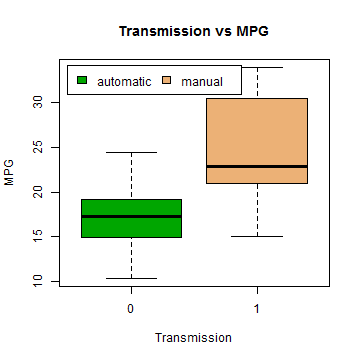
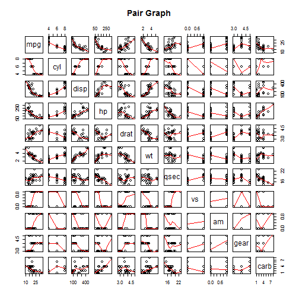

## Executive Summary  
In this article, we will look at the effect of automatic vs manual transmission on fuel efficiency. To examine, we use a dataset for 32 automobiles (all 1973 - 1974 models) which includes a wide range of data comprising of mpg, number of cylinders, horse power etc. 

## Exploratory Data Analysis  

### Data Set
First, we look at the data set. This data set was extracted from the 1974 edition of Motor Trend magazine. It consists of 32 cars on following 11 different variables:

- Miles per US gallon
- Number of cylinders
- Displacement (cubic inches)
- Horsepower
- Rear axle ratio
- Weight (lb / 1000)
- 1/4 mile time
- V/S
- Transmission (automatic, manual)
- Number of Gears
- Number of carburetors

The exploratory analysis is described in **Appendix** section for the plots. The box plot shows hat on average there is a difference between fuel efficiency depending on the transmission type. The manual transmission yields higher MPG than the automatic transmission. The Diagnostic plots show Toyota Corolla and Fiat 128 have a very high fuel efficiency, while Chrysler Imperial has a low fuel efficiency. Toyota Corona has a medium fuel efficiency. The pair graph shows some higher correlations between Weight, Displacement, number of Cylinders and Horsepower variables.

## Regression Model
Stepwise model selection using backwards elimination was performed to determine the variables for the best model.

```r
full.model <- lm(mpg ~ ., data = mtcars)
best.model <- step(full.model, direction = "backward")
```

```
## Start:  AIC=70.9
## mpg ~ cyl + disp + hp + drat + wt + qsec + vs + am + gear + carb
## 
##        Df Sum of Sq    RSS    AIC
## - cyl   1    0.0799 147.57 68.915
## - vs    1    0.1601 147.66 68.932
## - carb  1    0.4067 147.90 68.986
## - gear  1    1.3531 148.85 69.190
## - drat  1    1.6270 149.12 69.249
## - disp  1    3.9167 151.41 69.736
## - hp    1    6.8399 154.33 70.348
## - qsec  1    8.8641 156.36 70.765
## <none>              147.49 70.898
## - am    1   10.5467 158.04 71.108
## - wt    1   27.0144 174.51 74.280
## 
## Step:  AIC=68.92
## mpg ~ disp + hp + drat + wt + qsec + vs + am + gear + carb
## 
##        Df Sum of Sq    RSS    AIC
## - vs    1    0.2685 147.84 66.973
## - carb  1    0.5201 148.09 67.028
## - gear  1    1.8211 149.40 67.308
## - drat  1    1.9826 149.56 67.342
## - disp  1    3.9009 151.47 67.750
## - hp    1    7.3632 154.94 68.473
## <none>              147.57 68.915
## - qsec  1   10.0933 157.67 69.032
## - am    1   11.8359 159.41 69.384
## - wt    1   27.0280 174.60 72.297
## 
## Step:  AIC=66.97
## mpg ~ disp + hp + drat + wt + qsec + am + gear + carb
## 
##        Df Sum of Sq    RSS    AIC
## - carb  1    0.6855 148.53 65.121
## - gear  1    2.1437 149.99 65.434
## - drat  1    2.2139 150.06 65.449
## - disp  1    3.6467 151.49 65.753
## - hp    1    7.1060 154.95 66.475
## <none>              147.84 66.973
## - am    1   11.5694 159.41 67.384
## - qsec  1   15.6830 163.53 68.200
## - wt    1   27.3799 175.22 70.410
## 
## Step:  AIC=65.12
## mpg ~ disp + hp + drat + wt + qsec + am + gear
## 
##        Df Sum of Sq    RSS    AIC
## - gear  1     1.565 150.09 63.457
## - drat  1     1.932 150.46 63.535
## <none>              148.53 65.121
## - disp  1    10.110 158.64 65.229
## - am    1    12.323 160.85 65.672
## - hp    1    14.826 163.35 66.166
## - qsec  1    26.408 174.94 68.358
## - wt    1    69.127 217.66 75.350
## 
## Step:  AIC=63.46
## mpg ~ disp + hp + drat + wt + qsec + am
## 
##        Df Sum of Sq    RSS    AIC
## - drat  1     3.345 153.44 62.162
## - disp  1     8.545 158.64 63.229
## <none>              150.09 63.457
## - hp    1    13.285 163.38 64.171
## - am    1    20.036 170.13 65.466
## - qsec  1    25.574 175.67 66.491
## - wt    1    67.572 217.66 73.351
## 
## Step:  AIC=62.16
## mpg ~ disp + hp + wt + qsec + am
## 
##        Df Sum of Sq    RSS    AIC
## - disp  1     6.629 160.07 61.515
## <none>              153.44 62.162
## - hp    1    12.572 166.01 62.682
## - qsec  1    26.470 179.91 65.255
## - am    1    32.198 185.63 66.258
## - wt    1    69.043 222.48 72.051
## 
## Step:  AIC=61.52
## mpg ~ hp + wt + qsec + am
## 
##        Df Sum of Sq    RSS    AIC
## - hp    1     9.219 169.29 61.307
## <none>              160.07 61.515
## - qsec  1    20.225 180.29 63.323
## - am    1    25.993 186.06 64.331
## - wt    1    78.494 238.56 72.284
## 
## Step:  AIC=61.31
## mpg ~ wt + qsec + am
## 
##        Df Sum of Sq    RSS    AIC
## <none>              169.29 61.307
## - am    1    26.178 195.46 63.908
## - qsec  1   109.034 278.32 75.217
## - wt    1   183.347 352.63 82.790
```

### Summary

```r
summary(best.model)
```

```
## 
## Call:
## lm(formula = mpg ~ wt + qsec + am, data = mtcars)
## 
## Residuals:
##     Min      1Q  Median      3Q     Max 
## -3.4811 -1.5555 -0.7257  1.4110  4.6610 
## 
## Coefficients:
##             Estimate Std. Error t value Pr(>|t|)    
## (Intercept)   9.6178     6.9596   1.382 0.177915    
## wt           -3.9165     0.7112  -5.507 6.95e-06 ***
## qsec          1.2259     0.2887   4.247 0.000216 ***
## am            2.9358     1.4109   2.081 0.046716 *  
## ---
## Signif. codes:  0 '***' 0.001 '**' 0.01 '*' 0.05 '.' 0.1 ' ' 1
## 
## Residual standard error: 2.459 on 28 degrees of freedom
## Multiple R-squared:  0.8497,	Adjusted R-squared:  0.8336 
## F-statistic: 52.75 on 3 and 28 DF,  p-value: 1.21e-11
```

### Result
Thus, this regression model  shows the best model includes cyl6, cyl8, hp, wt, and amManual variables. The adjusted R-squared indicates that about 84% of the variance is explained by the final model. The MPG decreases with higher number of cylinders, horsepower and weight. MPG increases with manual transmission.

## Appendix: Graphs

### Boxplot: Transmission vs MPG

```r
boxplot(mpg ~ am, data=mtcars, xlab="Transmission", ylab="MPG", col=terrain.colors(3))
title(main = "Transmission vs MPG")
legend("topleft", inset=.03, c("automatic", "manual"), fill=terrain.colors(3),horiz=TRUE)
```

 

### Pair Graph

```r
pairs(mtcars, panel=panel.smooth, main="Pair Graph")
```

 

### Residual Plots

```r
par(mfrow = c(2, 2))
plot(lm(mpg ~ wt + qsec + am + wt:am, data=mtcars))
```

 

